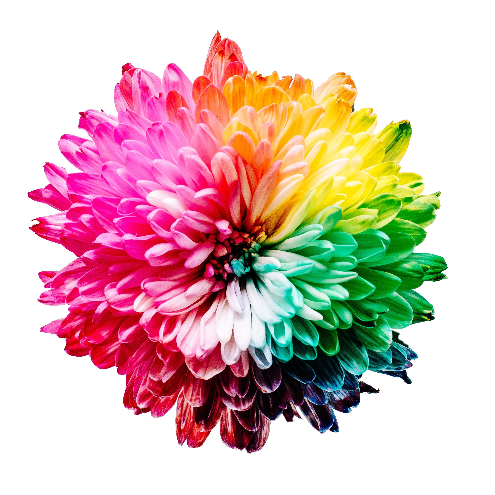

# React EyeDrop
> A highly customizable, flow-typed color eye-dropper for your React project.
<!--
[](https://bundlephobia.com/result?p=react-eyedrop@1.0.0)
[![NPM Version][npm-image]][npm-url]
[![Build Status][travis-image]][travis-url]
[![Downloads Stats][npm-downloads]][npm-url]
-->
With flexibility in mind, let your users eyedrop anything in your app within a minute.
Designed to work out of the box, the only required property to pass down is `onChange`.
A example project is included for basic usage.



###### Credits to [Sharon](https://unsplash.com/photos/iMdsjoiftZo) for such splendid taste in color.

## Installation

NPM:

```
npm install --save react-eyedrop
```

Yarn:

```
yarn add react-eyedrop
```

## API Reference

##### Table of contents
**[onChange](#api-onChange)** <br>
**[wrapperClasses](#api-wrapperClasses)** <br>
**[buttonClasses](#api-buttonClasses)** <br>
**[customComponent](#api-customComponent)** <br>
**[customProps](#api-customProps)** <br>
**[colorsPassThrough](#api-colorsPassThrough)** <br>
**[disabled](#api-disabled)** <br>
**[once](#api-once)** <br>
**[pickRadius](#api-pickRadius)** <br>
**[cursorActive](#api-cursorActive)** <br>
**[cursorInactive](#api-cursorInactive)** <br>
**[onInit](#api-onInit)** <br>
**[onPickStart](#api-onPickStart)** <br>
**[onPickEnd](#api-onPickEnd)** <br>

# <a name="api-onChange"></a>
#### **onChange**
###### `required`
###### Expects `function`
###### Returns an object:
###### Available properties` { rgb: string, hex: string, customProps: object } `
###### *This returns the picked color data and the user's passed in data object, see customProps for usage.*
*Example:*
```
function onChange({ rgb, hex }) {
    /* Do stuff */
}
<!-------->
<EyeDropper onChange={onChange} />
```

# <a name="api-wrapperClasses"></a>
#### **wrapperClasses**
###### Expects `string`
*Example:*
```
<EyeDropper wrapperClasses="my-css-class" />
/* or even */
<EyeDropper wrapperClasses={`my-css-class ${active ? 'my-active-css-class' : ''}`} />
```

# <a name="api-buttonClasses"></a>
#### **buttonClasses**
###### Expects `string`
*Example:*
```
<EyeDropper buttonClasses="my-css-class" />
/* or even */
<EyeDropper buttonClasses={`my-css-class ${active ? 'my-active-css-class' : ''}`} />
```

# <a name="api-customComponent"></a>
#### **customComponent**
###### Expects `React Node`
###### *Use your own component for your EyeDropping business.*
###### *Use the `onClick` prop which gets passed down.*
*Example:*
```
const Button = ({ onClick }) => 
    <button className="btn" onClick={onClick} >My custom button</button>
<!-------->
<EyeDropper customComponent={Button} />
```

# <a name="api-customProps"></a>
#### **customProps**
###### Expects `object`
###### Requires customComponent to be set
###### *User can pass in their own data to the customComponent, the data can then be retrieved along with the color values in the onChange handler.*
*Example:*
```
const onChange = ({ rgb, hex, customProps }) => {
    const { data1, data2, } = customProps
}
<!-------->
<Eyedropper customComponent={Button} customProps={{data1, data2, data3}} onChange={onChange}/>
```

# <a name="api-colorsPassThrough"></a>
#### **colorsPassThrough**
###### Expects `string`
###### *Provides access to the picked color value object { rgb, hex } for the eyedropper component.*
###### *Name provided here will be the name of the color object*
*Example:*
```
const Button = ({ onClick, pixelColors }) => 
    <button className="btn" onClick={onClick} style={{backgroundColor: pixelColors.hex}}>My custom button</button>
<!-------->
<EyeDropper customComponent={Button} colorsPassThrough='pixelColors' />
```

# <a name="api-disabled"></a>
#### **disabled**
###### Expects `boolean`
###### *Internal property provided by the eyedropper component for passing down to the customComponent. It gives control disabling the button element while color picking is active*

*Example:*
```
const Button = ({ onClick, disabled }) => 
    <button className="btn" onClick={onClick} disabled={disabled} >My custom button</button>
```

# <a name="api-once"></a>
#### **once**
###### Expects `boolean`
###### Defaults to `true`
###### *Decide if EyeDropping should stop after having pressed once. If you set this property to false, and then later change the value dynamically to true, you will ultimately remove the document event listener and resetting the body.cursor to cursorInactive.*
*Example:*
```
<EyeDropper once />
/* or */
<EyeDropper once={false} />
```

# <a name="api-pickRadius"></a>
#### **pickRadius**
###### Expects `number` 
###### Range `0-450`
###### *Size of the pick, defined in radius. Final value will be the average of the sum of all the color pixel within the radius.*
###### *radius = 1 <=> 3 x 3 blocks <=> 9 pixels*
###### *radius = 2 <=> 5 x 5 blocks <=> 25 pixels*
###### *radius = 3 <=> 7 x 7 blocks <=> 49 pixels*

*Example:*
```
<EyeDropper pickRadius={1} />
```

# <a name="api-cursorActive"></a>
#### **cursorActive**
###### Expects `string`
###### Defaults to `copy`
###### *Decide what CSS cursor to use when actively EyeDropping.*
###### [Link to CSS Cursors](https://www.w3schools.com/csSref/pr_class_cursor.asp)
*Example:*
```
<EyeDropper cursorActive="cursor" />
```

# <a name="api-cursorInactive"></a>
#### **cursorInactive**
###### Expects `string`
###### Defaults to `auto`
###### *Decide what CSS cursor to revert back to once finished with EyeDropping business.*
###### [Link to CSS Cursors](https://www.w3schools.com/csSref/pr_class_cursor.asp)
*Example:*
```
<EyeDropper cursorActive="auto" />
```

# <a name="api-onInit"></a>
#### **onInit**
###### Expects `function`
###### *Callback for componentDidMount*
*Example:*
```
function getPeanut() {
    console.log('Mmm... Definately overrated.')
}
<!-------->
<EyeDropper onInit={getPeanut} />
/* Will be called when component is mounted */
```

# <a name="api-onPickStart"></a>
#### **onPickStart**
###### Expects `function`
###### *Callback for when starting to EyeDrop*
*Example:*
```
function getBananas() {
    console.log('Ahhh... Much better.')
}
<!-------->
<EyeDropper onPickStart={getBananas} />
/* Will be called when starting to EyeDrop */
```

# <a name="api-onPickEnd"></a>
#### **onPickEnd**
###### Expects `function`
###### *Callback for when finished EyeDropping*
*Example:*
```
function byeNow() {
    console.log('Stay sharp, journeyman!')
}
<!-------->
<EyeDropper onPickEnd={byeNow} />
/* Will be called when finished EyeDropping */
```

## Development setup

Run the unit tests locally:

```
npm i
/* or */
yarn

/* and then */

npm run test
```

## Release History

* 3.0.0
    * Updated pickRadius feature to work with different units; radius & pixel.
* 2.1.2
    * Fixed typo in documentation
* 2.1.1
    * Added pickRadius feature
* 2.0.1
    * Updated documentation
* 2.0.0
    * Changed prop name from buttonComponent to customComponent
* 1.0.0
    * Initial release

## Meta

Manjodh "Jodhman" Singh – [manjodheriksingh@gmail.com](mailto:manjodheriksingh@gmail.com)

Distributed under the MIT license. See [license](https://opensource.org/licenses/MIT) for more information.

[https://github.com/jodhman/](https://github.com/jodhman/)

## Contributing

1. Fork it (<https://github.com/jodhman/react-eyedrop/fork>)
2. Create your feature branch (`git checkout -b feature/fooBar`)
3. Commit your changes (`git commit -am 'Add some fooBar'`)
4. Push to the branch (`git push origin feature/fooBar`)
5. Create a new Pull Request

<!-- Markdown link & img dfn's
[npm-image]: https://img.shields.io/npm/v/datadog-metrics.svg?style=flat-square
[npm-url]: https://npmjs.org/package/datadog-metrics
[npm-downloads]: https://img.shields.io/npm/dm/datadog-metrics.svg?style=flat-square
[travis-image]: https://img.shields.io/travis/dbader/node-datadog-metrics/master.svg?style=flat-square
[travis-url]: https://travis-ci.org/dbader/node-datadog-metrics
[wiki]: https://github.com/yourname/yourproject/wiki -->